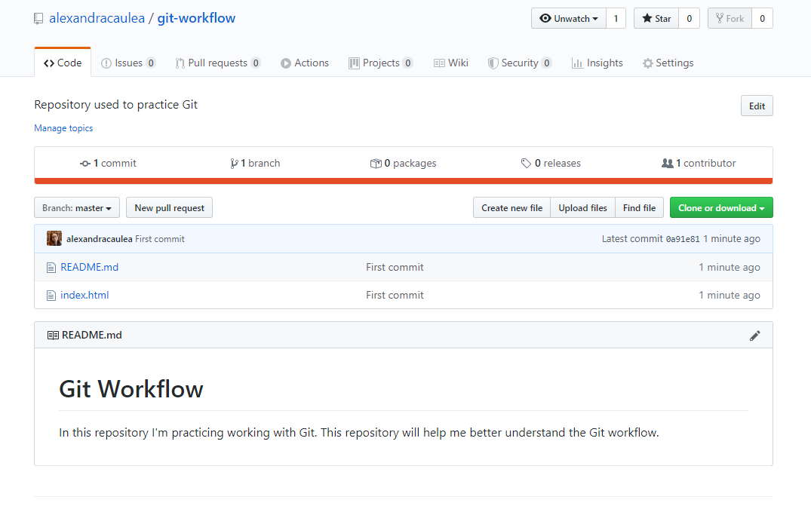

# Git Workflow

In this repository I'm practicing working with Git. This repository will help me better understand the Git workflow.

I've been working on my website and I wanted to scale it, add more content, use Gatsby but I didn't know how to use Git within it.

My Git workflow was pretty simple: it didn't exist.


As shown in the above diagram I had three branches:

1. Master - where I've had the past code when I used _Jekyll_;
2. Freshlook - the newly updated website with no code or content taken from the master branch;
3. Darkmode - I've created a branch based on freshlook branch and implemented darkmode.

I use _Netlify_ to deploy my code. In the past I've used _Netlify_ to point to the master branch, but when I finally decided to update my website, I pointed to the _freshlook_ branch.

After, I decided to implement a new feature and created a new branch called _darkmode_ where I've implemented the code and then I use _Netlify_ to point to the _darkmode_ branch.

As you see, everything was a mess and I started asking myself what is a simple workflow in small teams and how can I mimic it.

Fast forward a couple of days, after reading articles, going through Git documentation, watching a bunch of videos I've improved my workflow completely and it looks something like this:


My current workflow is pretty simple, I use the:

1. Master branch - where I have only the production code.
2. Develop branch - is the branch where I push the code on a regular basis with new features.
3. For each feature I started creating a new branch. Each feature branch uses develop as their parent branch and it does not interact directly with the master. The main rule I follow is each feature branches are created off the latest develop branch. After I finish working on a feature I merge it into the develop.
4. Hotfix branches are based on master instead of develop and as soon as the urgent fix is complete I merged it both into master and develop.

Even if currently I have only a one page website, I really wanted to use Git more easily and appropriate then I've used before. Keep in mind that I've started to research more only when I started to think how should I use Gatsby on my website, add content and pages (I currently working on this).

## Practice first

Instead of going on my repository and make a more mess that it was, I decided to start fresh with a new small repository, a few files to practice working with branches, figure out how to delete branches locally and remotely (since I actually needed to do in my project), learn new Git commands and many more things.

Below you will find the steps that I've used to practice, small snippets and things that I've learned. As I will learn more and my workflow will change, I will update the steps.

## Create a new repository on GitHub

Click on the **+** icon and select "New repository", add a name to the newly repository, add some short description and click the _Create repository_ button.

After you click the _Create repository_ button you will be taken to the quick setup screen.


_Note_: below are the steps to set up your repository from the command line.

Open your terminal, navigate to the directory of your choice, make a new folder, cd into the newly created folder and initialize the repository.
If you have configured to connect to GitHub using SSH, take the SSH version of the link if not take the HTTPS version.

To configure SSH follow [these](https://help.github.com/en/github/authenticating-to-github/generating-a-new-ssh-key-and-adding-it-to-the-ssh-agent) steps.

```
# Create a new directory for your repository
mkdir git-workflow

# cd into the newly created directory
cd git-workflow

# Initialize your Git repository
git init

# Setup the remote origin (your actual remote repository)
git remote add origin git@github.com:alexandracaulea/git-workflow.git
```

You can check the remote origin using `git remote -v`, you can also add or remove the newly added origin.

When you are checking the remote repository you should see URLs or SSH URLs which represents the path to the remote repository.

```
# Show the URL of the remote repository
git remote -v

# origin  git@github.com:alexandracaulea/git-workflow.git (fetch)
# origin  git@github.com:alexandracaulea/git-workflow.git (push)

# Add new-orign for the repository at git@github.com:alexandracaulea/git-workflow.git
git remote add new-origin git@github.com:alexandracaulea/git-workflow.git

git remote -v

# new-origin   git@github.com:alexandracaulea/git-workflow.git (fetch)
# new-origin   git@github.com:alexandracaulea/git-workflow.git (push)
# origin  git@github.com:alexandracaulea/git-workflow.git (fetch)
# origin  git@github.com:alexandracaulea/git-workflow.git (push)

# Remove the remote named new-origin
git remote remove new-origin

# origin  git@github.com:alexandracaulea/git-workflow.git (fetch)
# origin  git@github.com:alexandracaulea/git-workflow.git (push)
```

## Let's discuss about the workflow

Your local repository consists of three trees maintained by Git:

1. Working Directory - which holds the actual files;
2. Index - acts as a staging area;
3. HEAD - which points to the last commit you have made.


## Create some files

To mimic this workflow, let's create some files.

```
touch index.html
touch README.md
```

Open _index.html_:

```
code index.html
```

Add some HTML:

```html
<!DOCTYPE html>
<html lang="en">
  <head>
    <meta charset="UTF-8" />
    <meta name="viewport" content="width=device-width, initial-scale=1.0" />
    <title>Simple Page</title>
  </head>
  <body>
    <h1>Hello World</h1>
  </body>
</html>
```

Open _README_

```
code README.md
```

Add some text:

```
# Git Workflow

In this repository I'm practicing working with Git. This repository will help me better understand the Git workflow.
```

You can check the working tree status by typing in the Terminal:

```
git status
```

The output should be similar to this:

```
On branch master

No commits yet

Untracked files:
  (use "git add <file>..." to include in what will be committed)
        README.md
        index.html

nothing added to commit but untracked files present (use "git add" to track)
```

_Screenshot with my steps:_


## Add and Commit

You can add each file individually or add all files to the Index by using `git add <file_name>` or `git add .`

```
# Method 1: Add each file individually
git add index.html
git add README.md

# Method 2: Add all files from the current directory
git add .
```

Run `git status` to check the status:

```
On branch master

No commits yet

Changes to be committed:
  (use "git rm --cached <file>..." to unstage)
        new file:   README.md
        new file:   index.html
```

To actually commit these changes you can use `git commit -m "Commit message"`.

```
git commit -m "First commit"
```

Now the files are committed to the HEAD, but not in the remote repository.
To specify that we want to push the changes "upstream" to the remote repository run:

```
git push origin master
```

If you go to your repository and refresh the page you should see your files.



## Update the local repository

Since this is a workflow that simulates working with your team members, we can assume that one of them made some changes and committed them to the remote repository.

In order to mimic this behavior, I've created a user (user name _rand-usr_) and invited to be my collaborator on my repository. After the _rand-usr_ accepted the invitation, I've made a small change in _index.html_ on the remote repository and committed the changes.

Once those changes were made, the remote repository is currently _ahead_ of our local repository.

To avoid conflicts, you will need to update your local repository to the newest commit.
In order to "pull down", or "push downstream" those changes you should run `git pull`:

```
git pull origin master
```

Depending on the changes made by the team to the files you will see something similar to this:

```
# First check the status

PS D:\Dropbox\working-on\git-workflow> git status
On branch master
nothing to commit, working tree clean

# "Pull down" to our local repository

PS D:\Dropbox\working-on\git-workflow> git pull origin master
remote: Enumerating objects: 5, done.
remote: Counting objects: 100% (5/5), done.
remote: Compressing objects: 100% (3/3), done.
remote: Total 3 (delta 1), reused 0 (delta 0), pack-reused 0
Unpacking objects: 100% (3/3), done.
From github.com:alexandracaulea/git-workflow
 * branch            master     -> FETCH_HEAD
   0a91e81..015abbf  master     -> origin/master
Updating 0a91e81..015abbf
Fast-forward
 index.html | 1 +
 1 file changed, 1 insertion(+)
PS D:\Dropbox\working-on\git-workflow>
```

The output says that the _index.html_ file was changed and 1 insertion was made.

If you run again `git pull origin master` and `git push origin master`, if no changes was made in the meantime, you will see that the local and remote repositories are synced.

```
# Executing git pull origin master

PS D:\Dropbox\working-on\git-workflow> git pull origin master
From github.com:alexandracaulea/git-workflow
 * branch            master     -> FETCH_HEAD
Already up to date.

# Executing git push origin master

PS D:\Dropbox\working-on\git-workflow> git push origin master
Everything up-to-date
PS D:\Dropbox\working-on\git-workflow>
```

## Taging Production Releases

When we finally decided that we can release our first version of our application, we can tag the last commit to the master branch as version 1.

First we can check if there are any tags in the current repository using `git tag`:

```
# Run git tag

PS D:\Dropbox\working-on\git-workflow> git tag
PS D:\Dropbox\working-on\git-workflow>
```

To create a new tag, you should run the following command:

```
# Creating a new tag

git tag -a v1.0 -m "Releasing version v1.0"
```

The `-a` option stands for "annotated tag", `v1.0` is the actual tag and `-m` option is used to add a tag message.

To see the details of this tag we can type `git show v1.0`. This will show you who the tag details and information from the commit that was tagged.

```
# Show details for v1.0

PS D:\Dropbox\working-on\git-workflow> git show v1.0
tag v1.0
Tagger: Alexandra Caulea
Date:   Sun May 17 21:28:13 2020 +0300

Releasing version v1.0

commit 015abbfc7d912a632bb3857bf3855fded9baf106 (HEAD -> master, tag: v1.0, origin/master)
Author: rand-usr <65390036+rand-usr@users.noreply.github.com>
Date:   Sun May 17 21:22:37 2020 +0300

    Update index.html

diff --git a/index.html b/index.html
index a6857cd..6f383bf 100644
--- a/index.html
+++ b/index.html
@@ -3,6 +3,7 @@
   <head>
     <meta charset="UTF-8" />
     <meta name="viewport" content="width=device-width, initial-scale=1.0" />
+    <meta name="description" content="Git Workflow"/>
     <title>Simple Page</title>
   </head>
   <body>
PS D:\Dropbox\working-on\git-workflow>
```

Now we have to push this tag to our remote repository using the command: `git push --tags origin master`

```
# Push v1.0 tag to our remote repository

PS D:\Dropbox\working-on\git-workflow> git push --tags origin master
Enumerating objects: 1, done.
Counting objects: 100% (1/1), done.
Writing objects: 100% (1/1), 175 bytes | 87.00 KiB/s, done.
Total 1 (delta 0), reused 0 (delta 0)
To github.com:alexandracaulea/git-workflow.git
 * [new tag]         v1.0 -> v1.0
PS D:\Dropbox\working-on\git-workflow>
```

## Working with Branches

Some repositories will have different branches to record the history of the software, like develop, hotfix, branches for new features and so one.

1. Master branch should have production code only. Think about it as the branch that stores official release history.

2. Develop branch is the "live" version of the project and it servers as an integration branch for new features. This means, if you are working in a team, or even only by yourself, this branch is the one when you will push to code on a regular basis with new features.

3. Feature branches - each new feature should have its own branch, and should use develop as their parent branch. Each feature should not interact directly with the master branch. Think of each feature branch like a new chunck of code what will be eventually tested and added to the codebase. Feature branches are usually created off the latest develop branch.

4. Hotfixes branches used to quickly patch production releases.

5. And other branches.


Now, let's take a look at what branches we have in our repository using `git branch` command:

```
# Check our current branches

PS D:\Dropbox\working-on\git-workflow> git branch
* master
```

All you should see is the _master_ branch. Now, let's create a new branch and call it _develop_ by using `git branch develop` and then run again `git branch`.

```
# Create the develop branch

PS D:\Dropbox\working-on\git-workflow> git branch develop
PS D:\Dropbox\working-on\git-workflow> git branch
  develop
* master
```

At this point, we have two branches, master and develop, and we are currently on the master branch, denoted by the `*` in front of ths master.

Let's switch to the _develop_ branch to make some changes there. From now on, we will not make any changes directly to the master branch since we should not make any changes to our "production" release v1.0.

```
# Switching to develop branch

PS D:\Dropbox\working-on\git-workflow> git checkout develop
Switched to branch 'develop'
```

From now on, any changes we will make in the repository will be updated on the develop branch.

Let's make some changes in the repository by creating a _css_ folder and inside of it an _app.css_ file.

```
# Create the css folder

PS D:\Dropbox\working-on\git-workflow> mkdir css


    Directory: D:\git-workflow


Mode                LastWriteTime         Length Name
----                -------------         ------ ----
d-----        17-May-20   9:31 PM                css

# Create the app.css file inside the css folder

PS D:\Dropbox\working-on\git-workflow> touch css/app.css
Touching css/app.css

# Open the app.css file

PS D:\Dropbox\working-on\git-workflow> code css/app.css
PS D:\Dropbox\working-on\git-workflow>
```

In the _app.css_ add the below code:

```css
*,
*:before,
*:after {
  box-sizing: border-box;
}

body {
  min-height: 100vh;
  display: flex;
  justify-content: center;
  align-items: center;
  margin: 0;
  font-family: sans-serif;
  background-color: #faf2f2;
}

h1 {
  margin: 0;
  font-size: 5rem;
  font-size: 10vmax;
  font-weight: bold;
  letter-spacing: 7px;
  transform: rotate(-10deg);
}
```

In your _index.html_ add `<link rel="stylesheet" href="css/app.css" />`
.

Now we are ready to push our changes. First check the status, stage the updates, commit and push those changes.

```
# Check the status

PS D:\Dropbox\working-on\git-workflow> git status
On branch develop
Changes not staged for commit:
  (use "git add <file>..." to update what will be committed)
  (use "git restore <file>..." to discard changes in working directory)
        modified:   index.html

Untracked files:
  (use "git add <file>..." to include in what will be committed)
        css/

no changes added to commit (use "git add" and/or "git commit -a")

# Stage the updates
PS D:\Dropbox\working-on\git-workflow> git add .

# Commit the changes

PS D:\Dropbox\working-on\git-workflow> git commit -m "Update index, add css"
[develop b4242e3] Update index, add css
 2 files changed, 26 insertions(+), 1 deletion(-)
 create mode 100644 css/app.css

# Push the changes
PS D:\Dropbox\working-on\git-workflow> git push origin develop
Enumerating objects: 7, done.
Counting objects: 100% (7/7), done.
Delta compression using up to 8 threads
Compressing objects: 100% (4/4), done.
Writing objects: 100% (5/5), 678 bytes | 169.00 KiB/s, done.
Total 5 (delta 1), reused 0 (delta 0)
remote: Resolving deltas: 100% (1/1), completed with 1 local object.
remote:
remote: Create a pull request for 'develop' on GitHub by visiting:
remote:      https://github.com/alexandracaulea/git-workflow/pull/new/develop
remote:
To github.com:alexandracaulea/git-workflow.git
 * [new branch]      develop -> develop
PS D:\Dropbox\working-on\git-workflow>
```

Let's make more changes to our files, in the _index.html_ add:

```html
<link href="https://fonts.googleapis.com/css2?family=Oswald:wght@700&display=swap" rel="stylesheet" />
```

In the _app.css_ update the font of the _body_.

```css
body {
  font-family: "Oswald", sans-serif;
}
```

Now again, let's check the status, stage the updates, commit and push those changes to our remote repository.

```
# Check the status

PS D:\Dropbox\working-on\git-workflow> git status
On branch develop
Changes not staged for commit:
  (use "git add <file>..." to update what will be committed)
  (use "git restore <file>..." to discard changes in working directory)
        modified:   css/app.css
        modified:   index.html

no changes added to commit (use "git add" and/or "git commit -a")

# Stage the updates

PS D:\Dropbox\working-on\git-workflow> git add index.html
PS D:\Dropbox\working-on\git-workflow> git commit -m "Add font"
[develop 0cbf6e3] Add font
 1 file changed, 1 insertion(+)

# Check the status
PS D:\Dropbox\working-on\git-workflow> git status
On branch develop
nothing to commit, working tree clean

# After we made the changes, we stage again the updates

PS D:\Dropbox\working-on\git-workflow> git add app.css
PS D:\Dropbox\working-on\git-workflow> git commit -m "Add font in css file"
[develop e6c2dfc] Add font in css file
 1 file changed, 1 insertion(+), 1 deletion(-)

# Pushing the changes to our remote repository

PS D:\Dropbox\working-on\git-workflow> git push origin develop
Enumerating objects: 11, done.
Counting objects: 100% (11/11), done.
Delta compression using up to 8 threads
Compressing objects: 100% (6/6), done.
Writing objects: 100% (7/7), 748 bytes | 249.00 KiB/s, done.
Total 7 (delta 3), reused 0 (delta 0)
remote: Resolving deltas: 100% (3/3), completed with 3 local objects.
To github.com:alexandracaulea/git-workflow.git
   b4242e3..e6c2dfc  develop -> develop
```

Let's add a new feature to our application. Create a new branch, and set the HEAD pointer to point at this branch.

```
# Create feature-1 branch

PS D:\Dropbox\working-on\git-workflow> git branch feature-1

# Switch to the feature-1 branch

PS D:\Dropbox\working-on\git-workflow> git checkout feature-1
Switched to branch 'feature-1'
```

Let's edit our files. Add a script tag that points to _app.js_ file.

```html
<script src="js/app.js"></script>
```

Create a new folder and call it _js_ and inside of it a new file called _app.js_.

```
# Create the js folder

PS D:\Dropbox\working-on\git-workflow> mkdir js


    Directory: D:\Dropbox\working-on\git-workflow


Mode                LastWriteTime         Length Name
----                -------------         ------ ----
d-----        17-May-20   9:40 PM                js


# Create the app.js file inside of js folder
PS D:\Dropbox\working-on\git-workflow> touch js/app.js
Touching js/app.js

# Open the app.js file
PS D:\Dropbox\working-on\git-workflow> code js/app.js
```

Let's edit the _app.js_, _index.html_ and _app.css_ files.

In the _app.js_, add the below code:

```js
document.addEventListener("DOMContentLoaded", () => {
  const header = document.querySelector("h1");
  setTimeout(() => {
    header.classList.add("show");
  }, 1000);
});
```

In the _*index.html*_ add the below code.

```html
<script src="js/app.js"></script>
```

Update the _app.css_ and add the below code:

```css
h1 {
  transform: rotate(0deg);
  transition: all 1s ease-in-out;
}

h1.show {
  transform: rotate(-10deg);
  background: #ff00cc;
  background: linear-gradient(to right, #333399, #ff00cc);
  background-clip: text;
  -webkit-background-clip: text;
  -webkit-text-fill-color: transparent;
}
```

Now, let's check the staging area:

```
# Check the status

PS D:\Dropbox\working-on\git-workflow> git status
On branch feature-1
Changes not staged for commit:
  (use "git add <file>..." to update what will be committed)
  (use "git restore <file>..." to discard changes in working directory)
        modified:   css/app.css
        modified:   index.html

Untracked files:
  (use "git add <file>..." to include in what will be committed)
        js/

no changes added to commit (use "git add" and/or "git commit -a")
PS D:\Dropbox\working-on\git-workflow>
```

We are still on feature-1 branch, with 3 files in the staging area waiting to be committed. Let's commit and push them.

```
# Add all the changes to the Staging Area

PS D:\Dropbox\working-on\git-workflow> git add .

# Commit those changes

PS D:\Dropbox\working-on\git-workflow> git commit -m "Add JavaScript functionality"
[feature-1 0649fa1] Add JavaScript functionality
 3 files changed, 17 insertions(+)
 create mode 100644 js/app.js
PS D:\Dropbox\working-on\git-workflow>
```

## Merging Branches

Let's check our current branch by running `git log --oneline --decorate --graph --all`.

```
# Check the history

PS D:\Dropbox\working-on\git-workflow> git log --oneline --decorate --graph --all
* 0649fa1 (HEAD -> feature-1) Add JavaScript functionality
* e6c2dfc (origin/develop, develop) Add font in css file
* 0cbf6e3 Add font
* b4242e3 Update index, add css
* 015abbf (tag: v1.0, origin/master, master) Update index.html
* 0a91e81 First commit
```

By checking out our log command we can see that the _HEAD_ pointer is pointing at the _feature-1_ branch.

Our last commit on _develop_ branch was when we added the fonts (the commit starts with the hash 4ed0c4d).

The _master_ branch is way behind, when we tagged the initial version of the application.

Since we finished working on the _feature-1_ branch we should merge it to the _develop_ branch.

First we need to check the branch we are currently on, then we have to be on the **develop** branch in order to merge to it the _feature-1_ branch.

At the end we merge using `git merge feature-1`.

```
# See the list of our local branches

PS D:\Dropbox\working-on\git-workflow> git branch
  develop
* feature-1
  master

# Switching to the develop branch

PS D:\Dropbox\working-on\git-workflow> git checkout develop
Switched to branch 'develop'

# Merge our feature-1 into develop branch

PS D:\Dropbox\working-on\git-workflow> git merge feature-1
Updating e6c2dfc..0649fa1
Fast-forward
 css/app.css | 10 ++++++++++
 index.html  |  1 +
 js/app.js   |  6 ++++++
 3 files changed, 17 insertions(+)
 create mode 100644 js/app.js
PS D:\Dropbox\working-on\git-workflow>
```

Since we merged the feature-1 branch in the develop branch, we don't need anymore the feature-1 branch. Let's delete it using `git branch -d feature-1`. You should also see that your feature-1 no longer appears in our log command.

You should also see that your HEAD is pointing to our develop branch.

```
# See the list of our local branches

PS D:\Dropbox\working-on\git-workflow> git branch
* develop
  feature-1
  master

# Delete the feature-1 branch

PS D:\Dropbox\working-on\git-workflow> git branch -d feature-1
Deleted branch feature-1 (was 0649fa1).

# Check the history

PS D:\Dropbox\working-on\git-workflow> git log --oneline --decorate --graph --all
* 0649fa1 (HEAD -> develop) Add JavaScript functionality
* e6c2dfc (origin/develop) Add font in css file
* 0cbf6e3 Add font
* b4242e3 Update index, add css
* 015abbf (tag: v1.0, origin/master, master) Update index.html
* 0a91e81 First commit

# Check our local branches again
PS D:\Dropbox\working-on\git-workflow> git branch
* develop
  master
PS D:\Dropbox\working-on\git-workflow>
```

Let's merge our develop branch into master and tag the latest commit on master.

```
# Switch to master branch

PS D:\Dropbox\working-on\git-workflow> git checkout master
Switched to branch 'master'

# Merge develop into master

PS D:\Dropbox\working-on\git-workflow> git merge develop
Updating 015abbf..0649fa1
Fast-forward
 css/app.css | 34 ++++++++++++++++++++++++++++++++++
 index.html  |  5 ++++-
 js/app.js   |  6 ++++++
 3 files changed, 44 insertions(+), 1 deletion(-)
 create mode 100644 css/app.css
 create mode 100644 js/app.js

# Tag our v1.1 release

PS D:\Dropbox\working-on\git-workflow> git tag -a v1.1 -m "Releasing version v1.1"

# Check our tags
PS D:\Dropbox\working-on\git-workflow> git tag
v1.0
v1.1

# Push our tags
PS D:\Dropbox\working-on\git-workflow> git push --tags origin master
Enumerating objects: 1, done.
Counting objects: 100% (1/1), done.
Writing objects: 100% (1/1), 174 bytes | 87.00 KiB/s, done.
Total 1 (delta 0), reused 0 (delta 0)
To github.com:alexandracaulea/git-workflow.git
 * [new tag]         v1.1 -> v1.1
PS D:\Dropbox\working-on\git-workflow>
```

Now, we should push to our remote repository all of our changes:

```
# Push the changes to the develop branch

PS D:\Dropbox\working-on\git-workflow> git push origin develop
Enumerating objects: 11, done.
Counting objects: 100% (11/11), done.
Delta compression using up to 8 threads
Compressing objects: 100% (5/5), done.
Writing objects: 100% (7/7), 857 bytes | 171.00 KiB/s, done.
Total 7 (delta 2), reused 0 (delta 0)
remote: Resolving deltas: 100% (2/2), completed with 2 local objects.
To github.com:alexandracaulea/git-workflow.git
   e6c2dfc..0649fa1  develop -> develop

# Push the changes to the master branch
PS D:\Dropbox\working-on\git-workflow> git push origin master
Total 0 (delta 0), reused 0 (delta 0)
To github.com:alexandracaulea/git-workflow.git
   015abbf..0649fa1  master -> master
```

## Quick note

I am still learning and improving this workflow.

## Reference

I was not able to understand this Git workflow without the help of the articles, youtube videos and documentation written by many people. I will refer to them here:

1. [Git documentation](https://git-scm.com/)
2. [Git Explained: The Basics](https://dev.to/milu_franz/git-explained-the-basics-igc)
3. [A Tutorial for Tagging Releases in Git](https://dev.to/neshaz/a-tutorial-for-tagging-releases-in-git-147e)
4. [Gitflow Workflow](https://www.atlassian.com/git/tutorials/comparing-workflows/gitflow-workflow)
5. [Git from Scratch playlist](https://www.youtube.com/playlist?list=PLriKzYyLb28nCh3jJLROcYBvj7ZO0l-3G)
6. [Git Crash Course](https://www.youtube.com/playlist?list=PLYQSCk-qyTW3lX_dyw0R2eVzNGB3Tlv9S)
